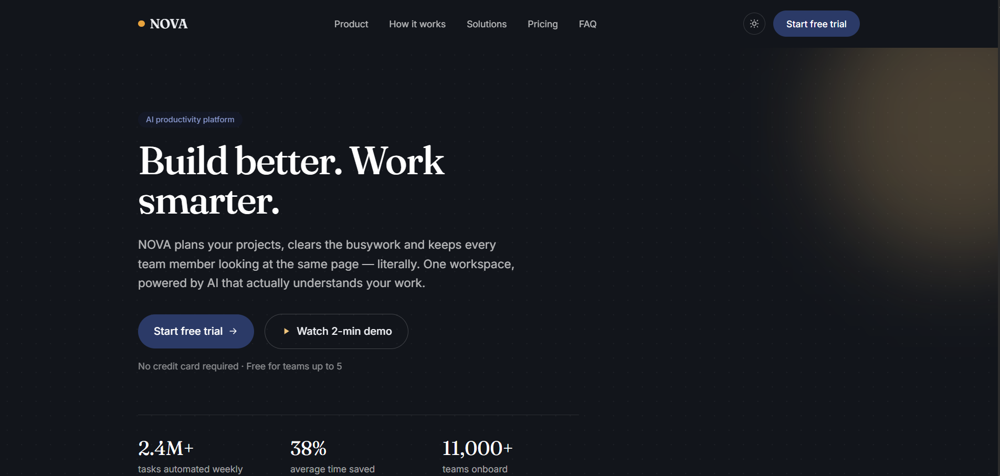
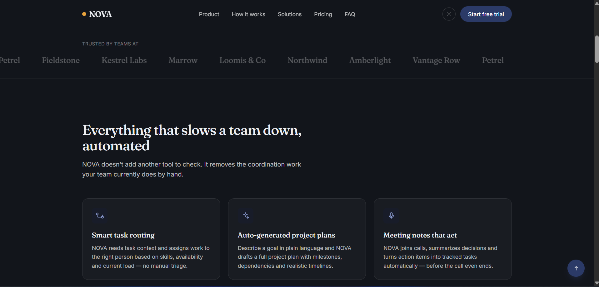
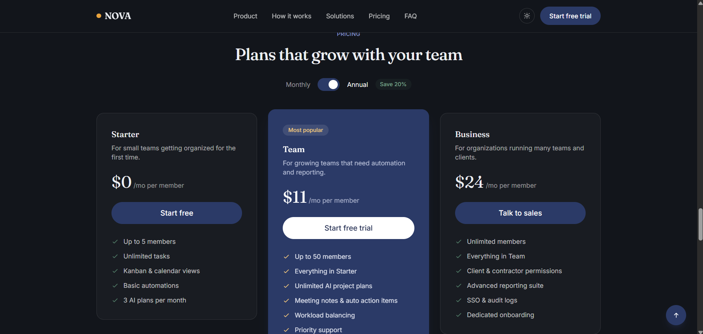
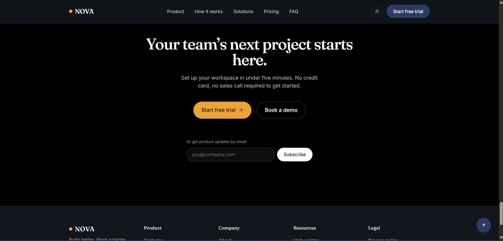

# NOVA — AI Productivity Platform Landing Page

This is my submission for the Front-End Development Intern assignment — a fully
responsive landing page for a fictional company. I went with the suggested brand,
**NOVA**, an AI productivity platform for teams.

**Tagline:** Build Better. Work Smarter.

---

## Live Demo

**https://nova-murex-seven.vercel.app**

## Repo

https://github.com/irfansm07/NOVA--Company.

## What I built it with

- **React 18** — function components + hooks, no class components
- **Vite** — for the dev server and the production build
- **Tailwind CSS** — I set up a custom theme in `tailwind.config.js` (colors, fonts,
  a couple of custom keyframes) instead of using the default Tailwind palette, so it
  wouldn't look like every other Tailwind template out there
- No icon library, no animation library, no UI kit. The icons are hand-written SVGs
  in `Icon.jsx` and the animations are plain CSS transitions + one small custom hook
  for scroll-triggered stuff. I didn't want to pull in a 200KB icon pack for 15 shapes.

I picked React because the brief said it's preferred, and Vite over Create React App
because it's just faster and it's what most teams actually use now. Tailwind because I
wanted the whole color/type system centralized in one config file instead of scattered
across component files.

## Sections included

Nav bar, hero, trusted-by logo strip, 6 features, product/about section, how-it-works
(3 steps), animated stats, solutions/use-cases, testimonials (carousel, 4 quotes),
pricing (3 plans + monthly/annual toggle), FAQ accordion (6 questions), final CTA with
a newsletter box, and a footer.

## Interactions / things that actually work

- Responsive nav that collapses into a hamburger menu on mobile
- Smooth scrolling to every section from the nav links
- FAQ accordion (click a question, it expands, click another, the first one closes)
- Hover effects on every button and card
- Dark/light mode toggle — remembers your choice via localStorage, also respects your
  OS setting on first visit
- Stats that count up from 0 when you scroll to them
- Testimonial carousel with arrows + dots
- Pricing toggle (monthly vs annual, with a "save 20%" badge)
- A demo modal that pops up from two different CTA buttons
- Newsletter input that actually validates the email and shows an error/success message
- Back-to-top button that shows up once you've scrolled down a bit

Basically I tried to cover the required interaction list and then add a few extra ones
from the bonus list since they weren't too much extra work once the core layout was
solid.

## Folder structure

```
nova-landing/
├── index.html
├── package.json
├── tailwind.config.js
├── postcss.config.js
├── vite.config.js
└── src/
    ├── main.jsx
    ├── App.jsx              # ties all the sections together, holds theme + modal state
    ├── index.css
    ├── data/
    │   └── content.js        # all the actual text/copy lives here, not scattered in JSX
    ├── hooks/
    │   └── useInView.js       # small IntersectionObserver hook, used by Stats + Features
    └── components/
        ├── Icon.jsx
        ├── Navbar.jsx
        ├── Hero.jsx
        ├── TrustedBy.jsx
        ├── Features.jsx
        ├── Product.jsx
        ├── HowItWorks.jsx
        ├── Stats.jsx
        ├── Solutions.jsx
        ├── Testimonials.jsx
        ├── Pricing.jsx
        ├── FAQ.jsx
        ├── FinalCTA.jsx
        ├── Footer.jsx
        ├── BackToTop.jsx
        └── DemoModal.jsx
```

I split every section into its own component instead of one giant App.jsx file mainly
because it made it way easier to work on one part without scrolling through 800 lines,
and it's closer to how a real codebase would be organized.

## Running it locally

You need Node 18 or newer.

```bash
npm install
npm run dev
```

That starts the dev server, usually at `http://localhost:5173`.

To build for production:

```bash
npm run build
```

Output goes into `/dist`. You can check the build locally with:

```bash
npm run preview
```

## How I deployed it

Pushed the repo to GitHub, then imported it into Vercel (vercel.com/new → import from
GitHub). Vercel picked up that it's a Vite project automatically — didn't have to touch
## Screenshots




h component. I didn't just take what
it gave me and ship it though — I went through the design choices myself first (the
color palette, the font pairing, why the hero is left-aligned instead of centered),
had Claude implement that direction, and then went back and forth fixing things that
looked off (there's actually a whole toggle-switch positioning bug I had to get fixed
after I first pushed this — a classic case of "looked fine on my screen, broke on
review"). I also used it to help draft the placeholder marketing copy since I'm not a
copywriter and NOVA is a made-up product anyway.

I can walk through and explain any part of this code — see `EXPLANATION.md` for more
detail on the reasoning, and I'm happy to make live changes during review if asked.

## Screenshots

_(adding these before final submission)_

- Desktop — hero + features
- Mobile — hamburger menu open
- Pricing section with the toggle